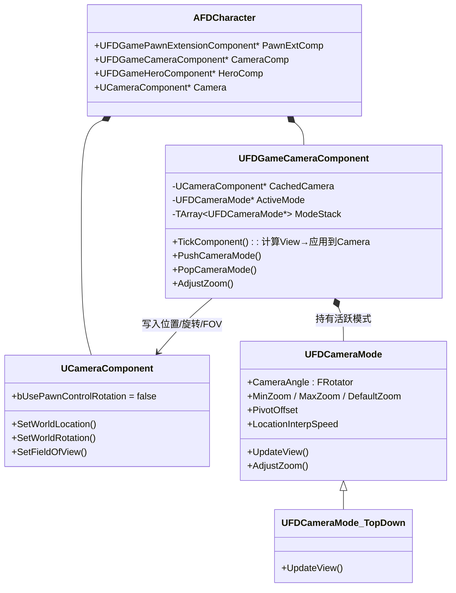
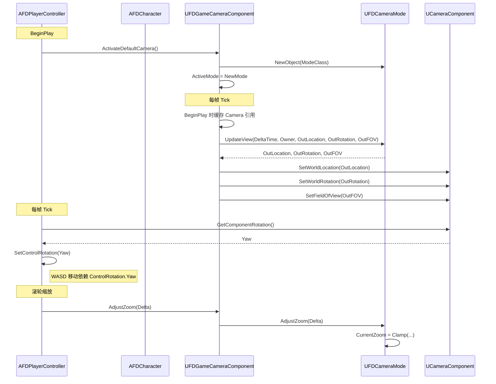

# 相机系统修复 架构设计

## 1. 需求概述

- **问题**：当前相机模式系统（`UFDCameraMode` + `UFDGameCameraComponent`）只计算 View 数据，但：
  1. `AFDCharacter` 缺少 `UCameraComponent`（无渲染出口）
  2. `UFDGameCameraComponent::TickComponent` 为空
  3. `AFDPlayerController::Tick` 中 `UpdateView()` 计算出的 `OutLocation` 被丢弃
  4. `HandleWASDMove` 依赖 `ControlRotation`，但 `ControlRotation` 只在 PC Tick 中设置，未跟随相机实际位置
- **目标**：修复上述断链，使俯视角相机完整工作
- **约束**：保持 Lyra 风格的架构化设计（UObject CameraMode + 模式栈 + PawnData 驱动）

## 2. Lyra 对照分析

Lyra 的相机架构：
```
ALyraCharacter
  ├─ UCameraComponent (渲染相机，挂在 RootComponent 或 SpringArm)
  └─ ULyraCameraComponent (ActorComponent, 管理 CameraMode 栈)
       └─ ULyraCameraMode (UObject, 纯数据+逻辑)
            UpdateView(FMinimalViewInfo&)
```

Lyra 的 `ULyraCameraComponent`：
- 持有 `UCameraComponent*` 引用
- 在 `GetCameraView` 或 Tick 中调用 `CameraMode->UpdateView()` 
- 将计算出的 `FMinimalViewInfo` 应用到 `UCameraComponent`
- 模式栈支持 Blend（多模式混合）

FD 对标设计：`UFDGameCameraComponent` 应负责"计算 View → 应用到 UCameraComponent"的完整管线。

## 3. 修复方案

### 3.1 类关系（修复后）



### 3.2 修复点清单

| # | 文件 | 变更类型 | 说明 |
|---|------|---------|------|
| 1 | `AFDCharacter.h` | 修改 | 添加 `UCameraComponent* Camera` 成员 |
| 2 | `AFDCharacter.cpp` | 修改 | 构造函数中 `CreateDefaultSubobject<UCameraComponent>()`, 挂载到 RootComponent |
| 3 | `UFDGameCameraComponent.h` | 修改 | 添加 `UCameraComponent* CachedCamera`、新增 BeginPlay 重写 |
| 4 | `UFDGameCameraComponent.cpp` | 修改 | BeginPlay 缓存 CameraComponent；TickComponent 中计算 View 并写入 Camera |
| 5 | `AFDPlayerController.cpp` | 修改 | Tick 中移除 UpdateView 逻辑，改为从 CameraComponent 同步 ControlRotation |
| 6 | `AFDPlayerController.h` | 修改 | 添加 `UpdateControlRotationFromCamera()` 辅助方法 |

### 3.3 数据流（修复后）



## 4. 关键实现细节

### 4.1 UCameraComponent 配置

```cpp
// AFDCharacter 构造函数
Camera = CreateDefaultSubobject<UCameraComponent>(TEXT("Camera"));
Camera->SetupAttachment(RootComponent);
Camera->bUsePawnControlRotation = false;  // TopDown: 相机位置由 CameraMode 手动控制
Camera->FieldOfView = 90.f;
```

不使用 `USpringArmComponent` —— 因为 `UFDCameraMode` 已手动计算位置，SpringArm 会造成双重变换。这符合 FD 的设计选择。

### 4.2 UFDGameCameraComponent::TickComponent

```cpp
void UFDGameCameraComponent::TickComponent(float DeltaTime, ...)
{
    if (!ActiveMode || !CachedCamera) return;
    
    AActor* Owner = GetOwner();
    if (!Owner) return;

    FVector OutLocation;
    FRotator OutRotation;
    float OutFOV;
    ActiveMode->UpdateView(DeltaTime, Owner, OutLocation, OutRotation, OutFOV);

    CachedCamera->SetWorldLocation(OutLocation);
    CachedCamera->SetWorldRotation(OutRotation);
    CachedCamera->SetFieldOfView(OutFOV);
}
```

### 4.3 AFDPlayerController 中 ControlRotation 同步

WASD 移动方向基于 `GetControlRotation().Yaw`，而相机的 Yaw 由 `CameraAngle`（-45°）决定。需要在 PC::Tick 中从 CameraComponent 同步：

```cpp
void AFDPlayerController::Tick(float DeltaSeconds)
{
    Super::Tick(DeltaSeconds);
    UpdateControlRotationFromCamera();
}

void AFDPlayerController::UpdateControlRotationFromCamera()
{
    if (APawn* Pawn = GetPawn())
    {
        if (UCameraComponent* Cam = Pawn->FindComponentByClass<UCameraComponent>())
        {
            SetControlRotation(Cam->GetComponentRotation());
        }
    }
}
```

原有的 `UpdateView` / `SetControlRotation` 逻辑从 PC::Tick 中移除。

### 4.4 AdjustZoom 保持

滚轮缩放链路不变：`PC::HandleMouseWheelZoom → CamComp::AdjustZoom → Mode::AdjustZoom`。Zoom 变化在下一帧 Tick 时通过 `UpdateView` 反映到相机位置。

## 5. 文件清单

| 文件路径 | 操作 | 说明 |
|---------|------|------|
| `Source/FD/Character/FDCharacter.h` | 修改 | 添加 `UCameraComponent* Camera` 成员 + 前向声明 |
| `Source/FD/Character/FDCharacter.cpp` | 修改 | 创建 `UCameraComponent` + 配置 |
| `Source/FD/Character/FDGameCameraComponent.h` | 修改 | 添加 `BeginPlay` override + `CachedCamera` 成员 |
| `Source/FD/Character/FDGameCameraComponent.cpp` | 修改 | 实现 BeginPlay + 完整 TickComponent |
| `Source/FD/Player/FDPlayerController.h` | 修改 | 添加 `UpdateControlRotationFromCamera()` |
| `Source/FD/Player/FDPlayerController.cpp` | 修改 | 重构 Tick，移除旧 UpdateView 逻辑 |

## 6. Camera 目录文件不变

`Camera/FDCameraMode.h/.cpp` 和 `Camera/FDCameraMode_TopDown.h/.cpp` **无需修改**。它们的设计是正确的——纯 UObject 计算 View，由 CameraComponent 负责渲染。

## 7. 兼容性说明

- `FDGamePawnData.DefaultCameraMode` → 目前未在代码中连接到 `UFDGameCameraComponent::DefaultModeClass`，这将在后续 Phase 中通过 PawnExtensionComponent 的 InitState 机制连接（PawnData 就位时设置 DefaultModeClass）
- 现有 BP 资产（`BP_Character`, `BP_CM_TopDown`）只需在蓝图编辑器中重新编译即可适配新的 `UCameraComponent`
