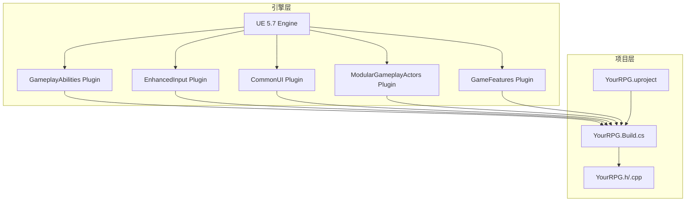
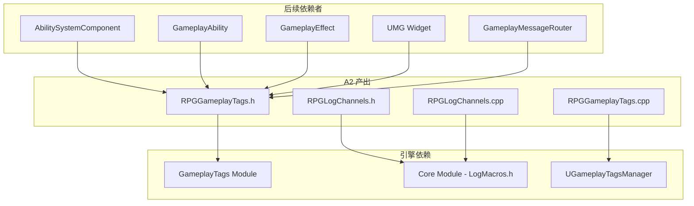
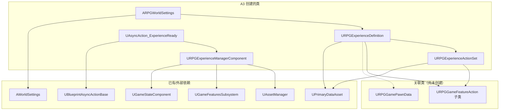
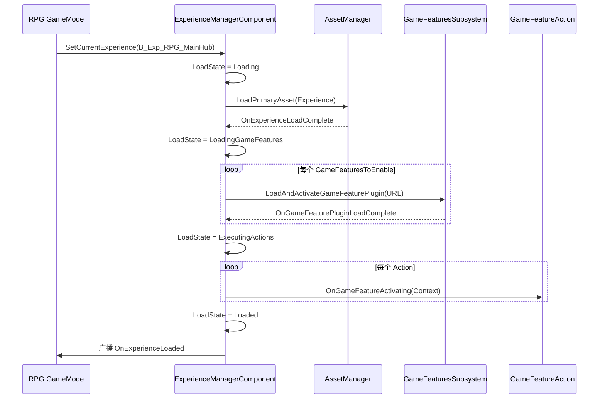
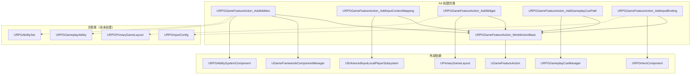
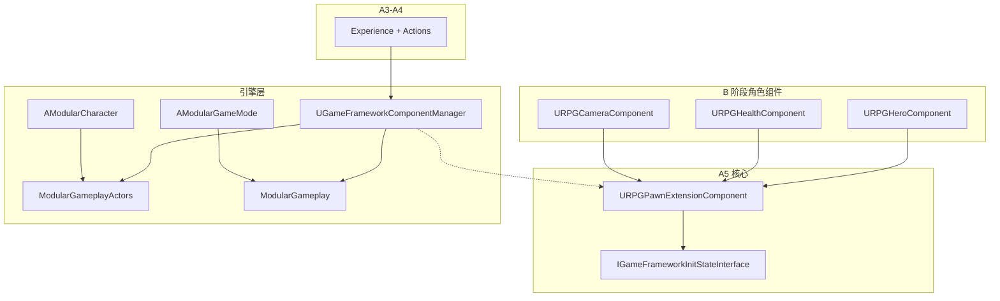
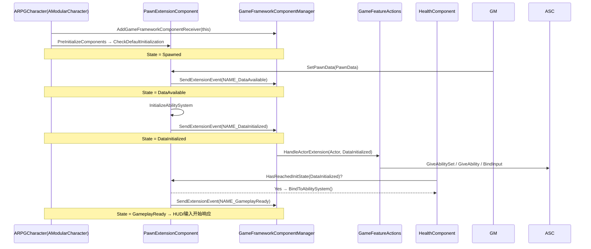
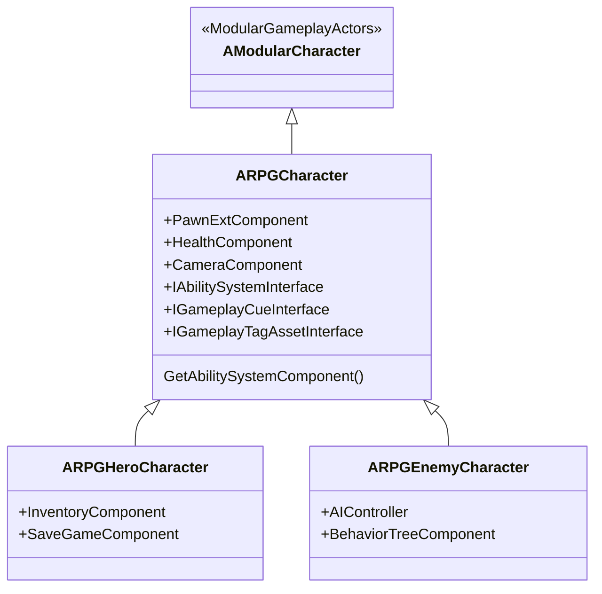

# 基石阶段（Stage A）详细开发方案

> 版本：v1.0  
> 日期：2026-06-09  
> 适用范围：从零搭建 RPG 项目，参考 LyraStarterGame 架构  
> 配套文档：[00_MasterPlan.md](./00_MasterPlan.md)

---

## 目录

1. [阶段总览](#1-阶段总览)
2. [A1：项目引导与 Lyra 剥离](#2-a1项目引导与-lyra-剥离)
3. [A2：GameplayTags 和 LogChannels](#3-a2gameplaytags-和-logchannels)
4. [A3：ExperienceDefinition 加载机制](#4-a3experiencedefinition-加载机制)
5. [A4：GameFeatureAction 扩展机制](#5-a4gamefeatureaction-扩展机制)
6. [A5：ModularActor 组件注入](#6-a5modularactor-组件注入)
7. [全局类依赖关系总图](#7-全局类依赖关系总图)
8. [开发注意事项](#8-开发注意事项)

---

## 1. 阶段总览

基石阶段是整个 RPG 项目的地基。目标是在**不写任何游戏玩法逻辑**的前提下，搭建出一套可运行的框架骨架，让后续的角色、战斗、装备等模块有处安放。

### 1.1 五个子阶段

| 子阶段 | 核心内容 | 工作量 | 是否写代码 |
|--------|----------|--------|------------|
| A1 | 项目引导 & Lyra 剥离 | 0.5 天 | ✅ 少量（配置为主） |
| A2 | GameplayTags & LogChannels | 1 天 | ✅ C++ 新文件 |
| A3 | ExperienceDefinition 加载机制 | 1.5 天 | ⚠️ 理解为主，创建蓝图 |
| A4 | GameFeatureAction 扩展机制 | 1 天 | ⚠️ 理解为主 |
| A5 | ModularActor 组件注入 | 1 天 | ⚠️ 理解为主，B 阶段才写代码 |

### 1.2 基石阶段结束时的验收标准

```
✅ PIE 启动成功，无崩溃
✅ GameplayTags 可在 C++ 和蓝图中正常使用
✅ 日志通道正常工作
✅ 创建了一份可用的 ExperienceDefinition 蓝图
✅ 理解 Experience 加载的 7 阶段状态机
✅ 理解 GameFeatureAction 的声明式注入模式
✅ 理解 ModularActor 的 InitState 四阶段
```

---

## 2. A1：项目引导与 Lyra 剥离

### 2.1 开发目标

从一个空的 UE 项目开始，引入 Lyra 的核心模块依赖，搭出一个可编译的最小骨架。

### 2.2 需要的插件/模块支持

#### 必须的引擎插件（`.uproject` 中启用）

| 插件名 | 类型 | 用途 |
|--------|------|------|
| `GameplayAbilities` | 引擎内置 | GAS 技能系统（整个战斗系统的基石） |
| `EnhancedInput` | 引擎内置 | 增强输入系统（按键绑定） |
| `CommonUI` | 引擎内置 | 跨平台 UI 框架 |
| `CommonGame` | 引擎内置 | CommonUI 配套游戏扩展 |
| `CommonUser` | 引擎内置 | 多用户/本地多人 |
| `CommonLoadingScreen` | 引擎内置 | 加载界面插件 |
| `ModularGameplayActors` | 引擎内置 | 模块化 Actor（A5 的基础） |
| `GameFeatures` | 引擎内置 | GameFeature 插件系统（A3-A4 的基础） |
| `GameplayMessageRouter` | 引擎内置 | 消息总线（解耦模块间通信） |
| `UIExtension` | 引擎内置 | UI 扩展点系统 |
| `GameSettings` | 引擎内置 | 设置存储框架 |

> **关键判断**：以上插件全部是 UE 5.7 引擎自带的，**不需要额外安装任何第三方插件**。Lyra 项目自带它们，从零搭建时只需在 `.uproject` 的 `Plugins` 数组中显式声明。

#### 必须的 C++ 模块（`Build.cs` 中声明）

```cpp
// YourRPG.Build.cs 的 PublicDependencyModuleNames
"Core", "CoreUObject", "Engine",           // 引擎核心
"GameplayTags",                             // A2 用
"GameplayTasks", "GameplayAbilities",       // C 阶段用（提前引入）
"ModularGameplay", "ModularGameplayActors", // A5 用
"GameFeatures",                             // A3-A4 用
"EnhancedInput",                            // B5 用
"GameplayMessageRuntime",                   // 消息路由器
"UMG", "CommonUI", "CommonInput",           // E 阶段 UI
"CommonGame", "CommonUser",                 // CommonUI 配套
"CommonLoadingScreen",                      // 加载界面
"UIExtension",                              // UI 扩展
"GameSettings",                             // 设置
"Niagara",                                  // 特效
"AIModule",                                 // G 阶段用
"DataRegistry",                             // 数据注册表
"SignificanceManager",                      // 性能优化
```

### 2.3 需要创建/修改的文件

| 文件 | 操作 | 说明 |
|------|------|------|
| `YourRPG.uproject` | **创建** | 声明插件列表 + 模块列表 |
| `Source/YourRPG/YourRPG.Build.cs` | **创建** | 模块依赖声明 |
| `Source/YourRPG/YourRPG.h` | **创建** | 模块主头文件 |
| `Source/YourRPG/YourRPG.cpp` | **创建** | 模块启动/关闭 |
| `Source/YourRPG.Target.cs` | **创建** | 编译目标 |
| `Source/YourRPGEditor.Target.cs` | **创建** | 编辑器编译目标 |
| `Config/DefaultEngine.ini` | **创建** | 引擎配置 |
| `Config/DefaultGame.ini` | **创建** | 游戏配置 |
| `Config/DefaultInput.ini` | **创建** | 输入配置（占位） |
| `Config/DefaultGameplayTags.ini` | **创建** | Tag 配置文件（A2 补充） |

### 2.4 不需要从 Lyra 搬过来的内容

| Lyra 原文件/目录 | 原因 |
|------------------|------|
| `ShooterCore/` 插件 | 射击游戏专用，RPG 不需要 |
| `ShooterMaps/` 插件 | 射击游戏地图 |
| `ShooterExplorer/` 插件 | 射击游戏 UI |
| `TopDownArena/` 插件 | Lyra 自带的俯视角示例，RPG 会自己写 |
| Lyra 的武器/射击相关 GA | 如 `GA_Weapon_Fire` 等 |

### 2.5 类依赖关系（此阶段）



A1 阶段**不创建任何游戏逻辑类**，仅完成编译环境的搭建。

---

## 3. A2：GameplayTags 和 LogChannels

### 3.1 开发目标

建立一套规范的 GameplayTag 命名体系 + 日志通道，为后续所有模块提供统一的 Tag 常量和日志输出。

### 3.2 需要的插件/模块支持

| 插件/模块 | 是否已引入 | 用途 |
|-----------|-----------|------|
| `GameplayTags` | ✅ A1 已引入 | Native Tag 声明/注册 |
| `Core` | ✅ 引擎自带 | 日志宏 `DECLARE_LOG_CATEGORY_EXTERN` |

> 无额外插件依赖。

### 3.3 需要创建的类/文件

#### 3.3.1 核心 Tag 文件

| 文件 | 类/命名空间 | 说明 |
|------|------------|------|
| `Source/YourRPG/GameplayTags/RPGGameplayTags.h` | `namespace RPGGameplayTags` | 所有 RPG 原生 Tag 的声明 |
| `Source/YourRPG/GameplayTags/RPGGameplayTags.cpp` | `namespace RPGGameplayTags` | Tag 的定义注册 |

#### 3.3.2 Tag 分类清单

| 分类 | 前缀 | 包含的 Tag | 用途 |
|------|------|-----------|------|
| 属性-主属性 | `Attribute.Primary.*` | `Strength`, `Dexterity`, `Intelligence`, `Vitality` | C2 阶段 RPG 属性系统 |
| 属性-二级属性 | `Attribute.Secondary.*` | `Armor`, `CritChance`, `CritDamage`, `AttackPower`, `SpellPower` | C2 伤害计算 |
| 属性-Vital | `Attribute.Vital.*` | `Health`, `Mana`, `Stamina` | C1 生命法力 |
| 属性-Meta | `Attribute.Meta.*` | `Level`, `Experience` | F1 等级经验 |
| 伤害类型 | `Damage.*` | `Physical`, `Fire`, `Frost`, `Lightning` | C7 伤害计算类型判定 |
| 技能输入 | `InputTag.Ability.*` | `Ability.1`(Q), `Ability.2`(W), `Ability.3`(E), `Ability.4`(R) | C4 技能按键 |
| 通用输入 | `InputTag.*` | `Move`, `Look`, `Jump`, `Interact`, `Inventory`, `SkillTree` | B5 输入配置 |
| 初始化状态 | `InitState.*` | `Spawned`, `DataAvailable`, `DataInitialized`, `GameplayReady` | A5 ModularActor |
| 状态 | `Status.*` | `Death.Dying`, `Death.Dead` | C10 死亡流程 |
| UI 层 | `UI.Layer.*` | `HUD`, `Menu`, `Modal`, `Game` | E1 UI 分层 |
| 消息通道 | `Message.*` | `Damage.Popup`, `XP.Gained`, `Loot.Dropped`, `Quest.Progress`, `LevelUp` | 跨模块通信 |
| 任务状态 | `Quest.State.*` | `Inactive`, `Active`, `Completed`, `Failed` | H4 任务系统 |
| GameplayEvent | `GameplayEvent.*` | `Death`, `Reset` | GA 间事件驱动 |
| SetByCaller | `SetByCaller.*` | `Damage`, `Heal`, `ManaCost` | GE 动态数值传入 |
| Ability 激活失败 | `Ability.ActivateFail.*` | `Cooldown`, `Cost`, `Mana` | UI 提示"蓝不够" |
| 冷却 | `Cooldown.*` | 每个技能独立 Tag | C5 CD 机制 |

#### 3.3.3 日志通道文件

| 文件 | 内容 | 说明 |
|------|------|------|
| `Source/YourRPG/LogChannels/RPGLogChannels.h` | `DECLARE_LOG_CATEGORY_EXTERN` | 日志分类声明 |
| `Source/YourRPG/LogChannels/RPGLogChannels.cpp` | `DEFINE_LOG_CATEGORY` | 日志分类定义 |

建议的日志分类：

```cpp
DECLARE_LOG_CATEGORY_EXTERN(LogRPG,          Log, All);  // 通用
DECLARE_LOG_CATEGORY_EXTERN(LogRPGGAS,       Log, All);  // GAS 相关
DECLARE_LOG_CATEGORY_EXTERN(LogRPGAttribute, Log, All);  // 属性变化
DECLARE_LOG_CATEGORY_EXTERN(LogRPGQuest,     Log, All);  // 任务
DECLARE_LOG_CATEGORY_EXTERN(LogRPGLoot,      Log, All);  // 掉落/拾取
DECLARE_LOG_CATEGORY_EXTERN(LogRPGSaveGame,  Log, All);  // 存档
DECLARE_LOG_CATEGORY_EXTERN(LogRPGAI,        Log, All);  // AI 行为
DECLARE_LOG_CATEGORY_EXTERN(LogRPGUI,        Log, All);  // UI
```

### 3.4 类依赖关系



> **关键依赖顺序**：GameplayTags 必须在 `UGameplayTagsManager` 初始化时（引擎启动早期）注册完毕。Native Tag 通过 `UE_DEFINE_GAMEPLAY_TAG_COMMENT` 在静态初始化阶段注册，无需手动调用初始化函数。

---

## 4. A3：ExperienceDefinition 加载机制

### 4.1 开发目标

理解并掌握 `ULyraExperienceDefinition` 的设计模式，创建第一个 RPG 用的 ExperienceDefinition 蓝图资产。

### 4.2 需要的插件/模块支持

| 插件/模块 | 是否已引入 | 用途 |
|-----------|-----------|------|
| `GameFeatures` | ✅ A1 | GameFeature 激活/停用 |
| `ModularGameplay` | ✅ A1 | `UGameFrameworkComponentManager` |

> **⚠️ 重要**：A3 阶段**不需要**从 Lyra 复制任何源码。需要先理解 Lyra 的设计，然后在自己的项目中**参考其设计创建自己的类**。

### 4.3 需要创建的类/文件

#### 4.3.1 C++ 类

| 类名 | 文件 | 基类 | 说明 |
|------|------|------|------|
| `URPGExperienceDefinition` | `Source/YourRPG/GameModes/RPGExperienceDefinition.h/.cpp` | `UPrimaryDataAsset` | RPG 体验定义数据资产 |
| `URPGExperienceActionSet` | `Source/YourRPG/GameModes/RPGExperienceActionSet.h/.cpp` | `UPrimaryDataAsset` | Action 分组复用 |
| `URPGExperienceManagerComponent` | `Source/YourRPG/GameModes/RPGExperienceManagerComponent.h/.cpp` | `UGameStateComponent` | 体验加载状态机 |
| `ARPGWorldSettings` | `Source/YourRPG/GameModes/RPGWorldSettings.h/.cpp` | `AWorldSettings` | 关卡默认 Experience |

#### 4.3.2 蓝图资产

| 资产名 | 类型 | 说明 |
|--------|------|------|
| `B_Exp_RPG_MainHub` | `URPGExperienceDefinition` | 主城 Experience |
| `B_Exp_RPG_Dungeon01` | `URPGExperienceDefinition` | 副本 Experience |

#### 4.3.3 `URPGExperienceDefinition` 核心字段

```cpp
UCLASS(BlueprintType, Const)
class URPGExperienceDefinition : public UPrimaryDataAsset
{
public:
    // 要激活的 GameFeature 插件 URL 列表
    UPROPERTY(EditDefaultsOnly, Category=Gameplay)
    TArray<FString> GameFeaturesToEnable;

    // 玩家默认使用的 PawnData（B1 阶段才创建）
    UPROPERTY(EditDefaultsOnly, Category=Gameplay)
    TObjectPtr<const URPGGamePawnData> DefaultPawnData;

    // 本 Experience 要执行的 Action 列表（A4 阶段使用）
    UPROPERTY(EditDefaultsOnly, Instanced, Category="Actions")
    TArray<TObjectPtr<URPGGameFeatureAction>> Actions;

    // 可复用的 Action 集合
    UPROPERTY(EditDefaultsOnly, Category=Gameplay)
    TArray<TObjectPtr<URPGExperienceActionSet>> ActionSets;
};
```

#### 4.3.4 `URPGExperienceManagerComponent` 状态机

```cpp
enum class ERPGExperienceLoadState
{
    Unloaded,                    // 未加载
    Loading,                     // 异步加载 Experience 资产
    LoadingGameFeatures,         // 激活 GameFeaturesToEnable
    ExecutingActions,            // 逐个执行 Actions
    Loaded,                      // 完成
    Deactivating                 // 正在卸载
};
```

#### 4.3.5 蓝图异步等待节点

| 类名 | 文件 | 说明 |
|------|------|------|
| `UAsyncAction_ExperienceReady` | `Source/YourRPG/GameModes/AsyncAction_ExperienceReady.h/.cpp` | 蓝图 `WaitForExperienceReady` 节点 |

### 4.4 类依赖关系



### 4.5 Experience 加载时序



### 4.6 此阶段的关键学习点

- **不写任何 GameFeatureAction 的实现**（那是 A4 的内容），只需在 ExperienceDefinition 的 `Actions` 数组中预留位置。
- **DefaultPawnData 字段先留空**（B1 才创建 PawnData）。
- **GameFeaturesToEnable 先留空**（后面章节 DLC 化时才用）。

---

## 5. A4：GameFeatureAction 扩展机制

### 5.1 开发目标

理解 `URPGGameFeatureAction` 的声明式注入模式，掌握如何通过 Action 将 Ability/AttributeSet/Input/Widget 注入到运行时。

### 5.2 需要的插件/模块支持

| 插件/模块 | 是否已引入 | 用途 |
|-----------|-----------|------|
| `GameFeatures` | ✅ A1 | Action 基类 |
| `ModularGameplay` | ✅ A1 | `AddExtensionHandler` 机制 |
| `EnhancedInput` | ✅ A1 | `AddInputContextMapping` 需要 |

> 无额外插件依赖。所有 Action 的基类 `UGameFeatureAction` 来自 `GameFeatures` 模块。

### 5.3 需要创建的类/文件

#### 5.3.1 基类

| 类名 | 文件 | 基类 | 说明 |
|------|------|------|------|
| `URPGGameFeatureAction_WorldActionBase` | `Source/YourRPG/GameFeatures/RPGGameFeatureAction_WorldActionBase.h/.cpp` | `UGameFeatureAction` | 延迟到有 World 再执行的 Action 基类 |

**为什么需要这个基类？** GameFeature 的激活可能发生在 Editor 中没有 World 的时刻。`WorldActionBase` 通过订阅 `UGameInstance` 的 `OnStart` 事件，确保 `AddToWorld` 在有 World 之后才调用。

```cpp
UCLASS(Abstract)
class URPGGameFeatureAction_WorldActionBase : public UGameFeatureAction
{
public:
    virtual void OnGameFeatureActivating(FGameFeatureActivatingContext& Context) override;
    virtual void OnGameFeatureDeactivating(FGameFeatureDeactivatingContext& Context) override;

    // 子类实现：有 World 时做什么
    virtual void AddToWorld(const FWorldContext& WorldContext,
                            const FGameFeatureStateChangeContext& ChangeContext) PURE_VIRTUAL(...);

private:
    TMap<FGameFeatureStateChangeContext, FDelegateHandle> GameInstanceStartHandles;
};
```

#### 5.3.2 内置 Action 子类（参考 Lyra 创建）

| 类名 | 文件 | 父类 | 用途 | 优先级 |
|------|------|------|------|--------|
| `URPGGameFeatureAction_AddAbilities` | `GameFeatures/RPGGameFeatureAction_AddAbilities.h/.cpp` | `WorldActionBase` | 给 Actor 注入 GA/AttributeSet/AbilitySet | ⭐ 核心 |
| `URPGGameFeatureAction_AddInputContextMapping` | `GameFeatures/RPGGameFeatureAction_AddInputContextMapping.h/.cpp` | `WorldActionBase` | 给玩家 Push IMC | ⭐ 核心 |
| `URPGGameFeatureAction_AddWidget` | `GameFeatures/RPGGameFeatureAction_AddWidget.h/.cpp` | `WorldActionBase` | 往 Layout 里加 Widget | ⭐ 核心 |
| `URPGGameFeatureAction_AddGameplayCuePath` | `GameFeatures/RPGGameFeatureAction_AddGameplayCuePath.h/.cpp` | `WorldActionBase` | 注册 Cue 扫描路径 | 重要 |
| `URPGGameFeatureAction_AddInputBinding` | `GameFeatures/RPGGameFeatureAction_AddInputBinding.h/.cpp` | `WorldActionBase` | 绑定 InputConfig 到 HeroComponent | 重要 |

#### 5.3.3 `AddAbilities` 的核心数据结构

```cpp
// 单个 Ability 授予项
USTRUCT(BlueprintType)
struct FRPGGameplayAbilityGrant
{
    UPROPERTY(EditAnywhere, meta=(AssetBundles="Client,Server"))
    TSoftClassPtr<URPGGameplayAbility> AbilityType;

    UPROPERTY(EditAnywhere)
    int32 AbilityLevel = 1;

    UPROPERTY(EditAnywhere, Meta=(Categories="InputTag"))
    FGameplayTag InputTag;  // ★ 与按键绑定对应
};

// 单个 AttributeSet 授予项
USTRUCT(BlueprintType)
struct FRPGAttributeSetGrant
{
    UPROPERTY(EditAnywhere, meta=(AssetBundles="Client,Server"))
    TSoftClassPtr<UAttributeSet> AttributeSetType;

    UPROPERTY(EditAnywhere, meta=(AssetBundles="Client,Server"))
    TSoftObjectPtr<UDataTable> InitializationData;  // 属性初始值表
};

// 一个注入目标
USTRUCT()
struct FRPGGameFeatureAbilitiesEntry
{
    UPROPERTY(EditAnywhere, Category="Abilities")
    TSoftClassPtr<AActor> ActorClass;  // ★ 注入到哪个 Actor 类

    UPROPERTY(EditAnywhere)
    TArray<FRPGGameplayAbilityGrant> GrantedAbilities;

    UPROPERTY(EditAnywhere)
    TArray<FRPGAttributeSetGrant> GrantedAttributes;

    UPROPERTY(EditAnywhere, meta=(AssetBundles="Client,Server"))
    TArray<TSoftObjectPtr<const URPGAbilitySet>> GrantedAbilitySets;
};
```

### 5.4 类依赖关系



### 5.5 `AddAbilities` 注入流程

```mermaid
sequenceDiagram
    participant EXP as ExperienceDefinition
    participant AA as AddAbilities Action
    participant MGR as GameFrameworkComponentManager
    participant Actor as ARPGCharacter(Spawned)
    participant ASC as AbilitySystemComponent

    EXP->>AA: OnGameFeatureActivating
    AA->>MGR: AddExtensionHandler(ActorClass, Callback)
    Note over AA,MGR: 注册回调：当 ActorClass 的实例 Ready 时通知我

    Actor->>MGR: SendExtensionEvent(NAME_GameActorReady)
    MGR->>AA: FExtensionHandlerDelegate.Execute(Actor)
    AA->>ASC: GetAbilitySystemComponentFromActor(Actor)
    loop 每个 AbilitySet
        AA->>ASC: AbilitySet->GiveToAbilitySystem(ASC)
    end
    loop 每个 Ability
        AA->>ASC: GiveAbility(Spec{GA, Level, InputTag})
    end
    loop 每个 AttributeSet
        AA->>ASC: AddAttributeSetSubobject(NewSet)
    end
```

### 5.6 此阶段的注意事项

- **此阶段不实现任何自定义 Action**（如刷怪、任务注入等），那是 G/H 阶段的事。
- **ActorClass 一定要填基类**：如 `ARPGCharacter` 而非 `ARPGHeroCharacter`，确保所有子类（Hero/Enemy/NPC）都收到注入。
- **所有资产引用必须用 `TSoftObjectPtr`/`TSoftClassPtr`**：硬引用会导致启动时加载全部资产，爆内存。

---

## 6. A5：ModularActor 组件注入

### 6.1 开发目标

理解 ModularGameplayActors 插件的"组件运行时注入"设计。这是 A3 Experience + A4 Action 能工作的底层支撑。

### 6.2 需要的插件/模块支持

| 插件/模块 | 是否已引入 | 用途 |
|-----------|-----------|------|
| `ModularGameplayActors` | ✅ A1 | `AModularCharacter`/`AModularPawn` 基类 |
| `ModularGameplay` | ✅ A1 | `UGameFrameworkComponentManager` |

> 无额外插件依赖。

### 6.3 需要创建的类/文件

#### 6.3.1 核心组件

| 类名 | 文件 | 基类 | 说明 |
|------|------|------|------|
| `URPGPawnExtensionComponent` | `Source/YourRPG/Character/RPGPawnExtensionComponent.h/.cpp` | `UPawnComponent` | **状态协调者**——Pawn 上所有组件的"总指挥" |

#### 6.3.2 InitState 四阶段

```
InitState_Spawned           ← Actor 刚 Spawn，组件刚 CreateDefaultSubobject
    ↓
InitState_DataAvailable     ← PawnData / Controller 已就位
    ↓
InitState_DataInitialized   ← AbilitySet 已授予、Input 已绑定、UI 已注入
    ↓
InitState_GameplayReady     ← 所有组件 ready，可以开始玩了
```

#### 6.3.3 `URPGPawnExtensionComponent` 关键职责

```cpp
UCLASS()
class URPGPawnExtensionComponent : public UPawnComponent, 
                                    public IGameFrameworkInitStateInterface
{
public:
    // 检查当前初始化状态
    bool HasReachedInitState(FGameplayTag DesiredState) const;
    
    // 推进到下一状态（内部调用 SendExtensionEvent 广播）
    void CheckDefaultInitialization();

    // 获取 Pawn 上的 ASC（区分玩家PlayerState / AI Pawn）
    URPGAbilitySystemComponent* GetRPGAbilitySystemComponent() const;

    // 缓存 PawnData（B1 阶段由 GameMode 写入）
    void SetPawnData(const URPGGamePawnData* InPawnData);
    const URPGGamePawnData* GetPawnData() const;

    // 初始化 ASC 的 ActorInfo（PossessedBy 时调用）
    void InitializeAbilitySystem(URPGAbilitySystemComponent* InASC, AActor* InOwner);

protected:
    // PawnData 缓存（B1 由 GameMode → SetPawnData 写入）
    UPROPERTY()
    TObjectPtr<const URPGGamePawnData> PawnData;

    // 当前初始化状态 Tag
    FGameplayTag CurrentInitState;
};
```

#### 6.3.4 其他组件订阅 PawnExtension 的方式

```cpp
// 示例：HealthComponent 等待 DataInitialized 再开始监听属性
void URPGHealthComponent::OnRegister()
{
    Super::OnRegister();
    // 注册：当 PawnExtension 进入 DataInitialized 时通知我
    RegisterInitStateFeature();
}

void URPGHealthComponent::OnActorInitStateChanged(
    const FActorInitStateChangedData& Data)
{
    if (Data.FeatureName == NAME_GameActorReady)
        return; // 未到我们要的时机
    if (!GetPawnExtensionComponent()->HasReachedInitState(
            RPGGameplayTags::InitState_DataInitialized))
        return;
    // 现在可以安全地绑定属性监听了
    BindToAbilitySystem();
}
```

### 6.4 类依赖关系



### 6.5 InitState 推进时序



### 6.6 类继承链（B 阶段预规划）



> **注意**：`ARPGCharacter` 是 B2 阶段才实现的类。A5 阶段只需要理解"我们会在 AModularCharacter 的基础上构建角色类"即可。

### 6.7 ASC 归属约定

| Actor 类型 | ASC 放在哪里 | 原因 |
|-----------|-------------|------|
| 玩家主角 | `ARPGPlayerState` | 生命周期与玩家绑定，不受 Pawn 销毁影响（如复活时 ASC 保留） |
| AI 敌人 | `ARPGCharacter`（自身） | 敌人死了 Pawn 和 ASC 一起销毁，不需要保留 |

`PawnExtensionComponent::GetRPGAbilitySystemComponent()` 负责自动查找正确的 ASC 位置。

---

## 7. 全局类依赖关系总图

### 7.1 基石阶段所有类一览

```mermaid
graph TD
    subgraph "A1 - 项目引导"
        UP[YourRPG.uproject]
        BM[YourRPG.Build.cs]
        MH[YourRPG.h/.cpp]
        T_CS[YourRPG.Target.cs]
        TE_CS[YourRPGEditor.Target.cs]
        INI[Config/*.ini]
    end

    subgraph "A2 - GameplayTags & Log"
        TAG_H[RPGGameplayTags.h]
        TAG_CPP[RPGGameplayTags.cpp]
        LOG_H[RPGLogChannels.h]
        LOG_CPP[RPGLogChannels.cpp]
    end

    subgraph "A3 - Experience"
        EXP_DEF[URPGExperienceDefinition]
        EXP_AS[URPGExperienceActionSet]
        EXP_MGR[URPGExperienceManagerComponent]
        WORLD_SET[ARPGWorldSettings]
        ASYNC[UAsyncAction_ExperienceReady]
    end

    subgraph "A4 - GameFeatureAction"
        WA[WorldActionBase]
        AA[AddAbilities]
        AIM[AddInputContextMapping]
        AW[AddWidget]
        AGC[AddGameplayCuePath]
        AIB[AddInputBinding]
    end

    subgraph "A5 - ModularActor"
        PEC[URPGPawnExtensionComponent]
    end

    subgraph "引擎/插件层（不创建）"
        UE[UE 5.7 Engine]
        GAS[GameplayAbilities]
        GF[GameFeatures]
        MA_M[ModularGameplay]
        MA_A[ModularGameplayActors]
        EI[EnhancedInput]
        CUI[CommonUI]
        GT[GameplayTags]
    end

    UP --> BM
    BM --> UE
    BM --> GAS
    BM --> GF
    BM --> MA_M
    BM --> EI
    BM --> CUI
    BM --> GT

    TAG_H --> GT
    EXP_DEF --> WA
    WA --> GF
    WA --> MA_M
    AA --> PEC
    PEC --> MA_A
    PEC --> MA_M
```



### 7.2 依赖方向

```
引擎层 (UE 5.7 + 插件)
    ↓ 依赖
项目 Build.cs (模块声明)
    ↓ 依赖
A2 GameplayTags / LogChannels (被所有模块依赖)
    ↓ 依赖
A3 ExperienceDefinition (定义一局游戏的配置)
    ↓ 依赖
A4 GameFeatureAction (声明式注入的载体)
    ↓ 依赖
A5 ModularActor (运行时注入的执行层)
    ↓ 下游
B 角色系统 → C 战斗系统 → D 装备系统 → ...
```

### 7.3 需要创建的源文件完整清单

```
Source/YourRPG/
├── YourRPG.Build.cs                              [A1]
├── YourRPG.h                                     [A1]
├── YourRPG.cpp                                   [A1]
├── YourRPG.Target.cs                             [A1]
├── YourRPGEditor.Target.cs                       [A1]
├── GameplayTags/
│   ├── RPGGameplayTags.h                         [A2]
│   └── RPGGameplayTags.cpp                       [A2]
├── LogChannels/
│   ├── RPGLogChannels.h                          [A2]
│   └── RPGLogChannels.cpp                        [A2]
├── GameModes/
│   ├── RPGExperienceDefinition.h                 [A3]
│   ├── RPGExperienceDefinition.cpp               [A3]
│   ├── RPGExperienceActionSet.h                  [A3]
│   ├── RPGExperienceActionSet.cpp                [A3]
│   ├── RPGExperienceManagerComponent.h           [A3]
│   ├── RPGExperienceManagerComponent.cpp         [A3]
│   ├── RPGWorldSettings.h                        [A3]
│   ├── RPGWorldSettings.cpp                      [A3]
│   ├── AsyncAction_ExperienceReady.h             [A3]
│   └── AsyncAction_ExperienceReady.cpp           [A3]
├── GameFeatures/
│   ├── RPGGameFeatureAction_WorldActionBase.h    [A4]
│   ├── RPGGameFeatureAction_WorldActionBase.cpp  [A4]
│   ├── RPGGameFeatureAction_AddAbilities.h       [A4]
│   ├── RPGGameFeatureAction_AddAbilities.cpp     [A4]
│   ├── RPGGameFeatureAction_AddInputContextMapping.h  [A4]
│   ├── RPGGameFeatureAction_AddInputContextMapping.cpp[A4]
│   ├── RPGGameFeatureAction_AddWidget.h          [A4]
│   ├── RPGGameFeatureAction_AddWidget.cpp        [A4]
│   ├── RPGGameFeatureAction_AddGameplayCuePath.h [A4]
│   ├── RPGGameFeatureAction_AddGameplayCuePath.cpp   [A4]
│   ├── RPGGameFeatureAction_AddInputBinding.h    [A4]
│   └── RPGGameFeatureAction_AddInputBinding.cpp  [A4]
└── Character/
    ├── RPGPawnExtensionComponent.h               [A5]
    └── RPGPawnExtensionComponent.cpp             [A5]

Content/RPG/
└── Experiences/
    ├── B_Exp_RPG_MainHub.uasset                  [A3]
    └── B_Exp_RPG_Dungeon01.uasset                [A3]

Config/
├── DefaultEngine.ini                             [A1]
├── DefaultGame.ini                               [A1]
├── DefaultInput.ini                              [A1]
└── DefaultGameplayTags.ini                       [A1/A2]
```

**共计：约 30 个 C++ 文件（.h/.cpp 对），4 个配置文件，2 个蓝图资产。**

---

## 8. 开发注意事项

### 8.1 基石阶段的核心原则

| 原则 | 说明 |
|------|------|
| **不写游戏逻辑** | 基石阶段不实现任何技能、伤害、UI。只搭建框架骨架 |
| **理解优于复制** | 每个机制先理解 Lyra 为什么这么设计，再在自己的项目中复刻 |
| **每个子阶段可编译** | 每完成一个子阶段，项目必须能成功编译 |
| **接口留好，实现留空** | 类的方法可以先 `unimplemented()`，等后续阶段再填充 |

### 8.2 关键风险

| 风险 | 影响范围 | 缓解方案 |
|------|----------|----------|
| Tag 命名不规范 | 全局（被所有模块引用） | A2 阶段在白板上画出完整的 Tag 层级树，团队 Review |
| ASC 位置搞错 | B/C/D 全部战斗系统 | 严格遵守"玩家→PlayerState，AI→Pawn"的约定 |
| Build.cs 漏模块 | 编译失败 | 按本文档的模块清单逐项核对 |
| Experience 加载时序理解错误 | A3-A5 联调异常 | 用 `UE_LOG` 在每个阶段打印日志，验证状态机 |

### 8.3 与后续阶段的接口预留

| 基石阶段产物 | 后续谁用 | 何时用 |
|-------------|---------|--------|
| `RPGGameplayTags.h` | 所有模块 | B 阶段起持续使用 |
| `RPGLogChannels.h` | 所有模块 | B 阶段起持续使用 |
| `URPGExperienceDefinition` | GameMode | B1 起关联 PawnData |
| `URPGGameFeatureAction_AddAbilities` | Experience 配置 | C3 起注入 AbilitySet |
| `URPGGameFeatureAction_AddWidget` | Experience 配置 | E1 起注入 HUD |
| `URPGGameFeatureAction_AddInputContextMapping` | Experience 配置 | B5 起注入 IMC |
| `URPGPawnExtensionComponent` | ARPGCharacter | B2 起挂载组件 |

### 8.4 Lyra 参考源码位置

如果在实现过程中遇到疑问，以下是 Lyra 中对应实现的源码位置（**仅供学习参考，不可直接复制**）：

| 机制 | Lyra 源码路径 |
|------|-------------|
| GameplayTags | `Source/LyraGame/LyraGameplayTags.h` |
| LogChannels | `Source/LyraGame/LyraLogChannels.h` |
| ExperienceDefinition | `Source/LyraGame/GameModes/LyraExperienceDefinition.h` |
| ExperienceManagerComponent | `Source/LyraGame/GameModes/LyraExperienceManagerComponent.h` |
| WorldActionBase | `Source/LyraGame/GameFeatures/GameFeatureAction_WorldActionBase.h` |
| AddAbilities | `Source/LyraGame/GameFeatures/GameFeatureAction_AddAbilities.h` |
| AddWidget | `Source/LyraGame/GameFeatures/GameFeatureAction_AddWidget.h` |
| PawnExtensionComponent | `Source/LyraGame/Character/LyraPawnExtensionComponent.h` |
| ModularCharacter | `Plugins/ModularGameplayActors/Source/ModularGameplayActors/Public/ModularCharacter.h` |

---

> **下一步**：完成基石阶段后，进入 [B 角色系统](../B_CharacterSystem.md) —— 创建 `URPGGamePawnData`、`ARPGCharacter`、`ARPGHeroCharacter`、`ARPGEnemyCharacter` 等核心角色类。
